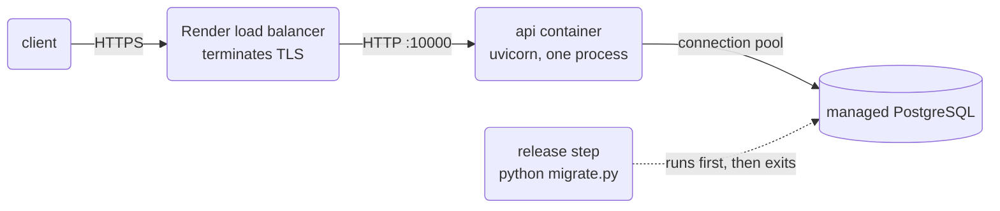

# Bookmarks API

A small JSON API over PostgreSQL. It stores bookmarks, tags, and a visit
counter. It runs in one container, it reads all of its configuration from the
environment, and it applies its own schema migrations before it starts.

The repository holds the measurements that justify each design choice. Every
number below is real output from a run on this machine.

*Live URL:* not deployed yet. Put the `https://<name>.onrender.com` address
here after the first deploy, and add `GET /healthz` next to it.

## Stack

| Part | Choice | Version |
| --- | --- | --- |
| Language | Python | 3.12 |
| Web framework | FastAPI | 0.141.1 |
| ASGI server | Uvicorn (`uvloop`, `httptools`) | 0.52.1 |
| Database driver | psycopg 3 with `psycopg_pool` | 3.3.4 |
| Database | PostgreSQL | 17 |
| Configuration | pydantic-settings | 2.14.2 |
| Container | Docker, `python:3.12-slim` | image 260 MB |
| Platform | Render (Blueprint in `render.yaml`) | — |

## Shape



The release step runs on a separate instance, before the new version of the
API takes any traffic. If a migration fails, the deploy fails and the previous
version keeps the traffic.

## Endpoints

| Method | Path | Purpose |
| --- | --- | --- |
| `GET` | `/healthz` | Run `SELECT 1`. The platform reads the status code. |
| `GET` | `/bookmarks` | List bookmarks with tags, one query, `skip` and `limit`. |
| `GET` | `/bookmarks/search` | Prefix search on the title, `text_pattern_ops` index. |
| `GET` | `/bookmarks/{id}` | One bookmark with its tags. |
| `POST` | `/bookmarks` | Create a bookmark and its tags in one transaction. |
| `POST` | `/bookmarks/{id}/visit` | Increment the visit counter in one statement. |
| `DELETE` | `/bookmarks/{id}` | Delete a bookmark. |

## Measured results

### The index

A prefix search over 200 000 rows, measured with `EXPLAIN (ANALYZE, BUFFERS)`
in `psql`, not with a timer around the HTTP request.

| Plan | Execution time |
| --- | --- |
| Sequential scan, no index | 11.810 ms |
| Index scan, B-tree with `text_pattern_ops` | 0.128 ms |

A B-tree on `title` alone does not serve `LIKE 'Article number 1370%'`,
because the default operator class sorts by collation. The `text_pattern_ops`
class sorts byte by byte, and the planner then uses the index.

### The N+1 problem

One list request that then reads the tags for each row, against one request
that joins.

| Environment | Slowdown of N+1 over the join |
| --- | --- |
| Loopback, no latency | 7× |
| Through a proxy that adds 1 ms each way | 51× |

The code did not change between the two rows. Only the network did. The API
now issues one query for the list, so the row count does not change the
number of round trips.

### The lost update

200 concurrent increments of the same counter, four strategies, same hardware.

| Strategy | Result | Wall time |
| --- | --- | --- |
| `SELECT` then `UPDATE`, two statements | 12 of 200 increments survived | — |
| `SELECT … FOR UPDATE` | 200 of 200 | 247.9 ms |
| One `UPDATE … SET visit_count = visit_count + 1` | 200 of 200 | 178.3 ms |
| `REPEATABLE READ` with retry | 200 of 200, 1411 retries | 772.3 ms |

The two-statement version raised nothing and exited zero. It returned a
plausible wrong number. `POST /bookmarks/{id}/visit` uses the one-statement
form.

## Deployment properties

Each item below is a check you can repeat.

1. *No secret in the image.* `docker image history --no-trunc` and
   `docker image inspect` print no password and no `DATABASE_URL`. The
   `.dockerignore` file keeps `.env` out of the build context.
2. *No configuration in the source.* `config.py` reads every value from the
   environment and validates it with pydantic. A missing or malformed
   `DATABASE_URL` stops the process at import, with the name of the variable
   in the message.
3. *One process, PID 1.* The container runs a single uvicorn process as PID 1,
   so it receives `SIGTERM` from the platform and shuts down in order.
4. *Not root.* The container runs as `appuser`, uid 10001.
5. *The port comes from the platform.* The command reads `${PORT:-8000}` and
   binds `0.0.0.0`.
6. *Idempotent migrations.* A second run of `python migrate.py` prints `skip`
   for every migration and changes nothing.
7. *Real health check.* `/healthz` runs a query. A container that cannot reach
   the database reports unhealthy instead of accepting traffic.

## Run it on one machine

```shell
cp .env.example .env          # then edit POSTGRES_PASSWORD
docker compose up --build
curl -s localhost:8007/healthz
```

Output:

```
{"status":"ok","env":"production"}
```

The stack starts in this order: the database becomes healthy, the release step
runs to completion, then the API starts.

```
migrate-1  | applied 0001_create_bookmarks
migrate-1  | applied 0002_create_tags
migrate-1  | applied 0003_add_title_search_index
migrate-1  | applied 0004_add_visit_count
api-1      | INFO:     Uvicorn running on http://0.0.0.0:8000 (Press CTRL+C to quit)
```

The database lives in a named volume. `docker compose down` keeps it.

Warning: `docker compose down -v` deletes the volume and all of the data. Use
it only when you want an empty database.

## Deploy it

`render.yaml` declares the database and the web service. The database writes
its own connection string into the service, so no human copies a password.

```shell
render blueprints validate render.yaml
```

Then point a Render Blueprint at the repository. The service uses
`preDeployCommand: python migrate.py`, which needs a paid instance type. On a
Free instance, chain the migration into the start command instead; the runner
is idempotent, so a repeat is safe.

## Layout

```
config.py         every setting, typed, from the environment
main.py           the FastAPI application
migrate.py        the release step
migrations/       0001 … 0004, applied in order, recorded in schema_migrations
Dockerfile        the image
compose.yaml      the local rehearsal: database, release step, API
render.yaml       the deploy, as a file
naive/            the same app deployed badly, kept to show the failures
```
