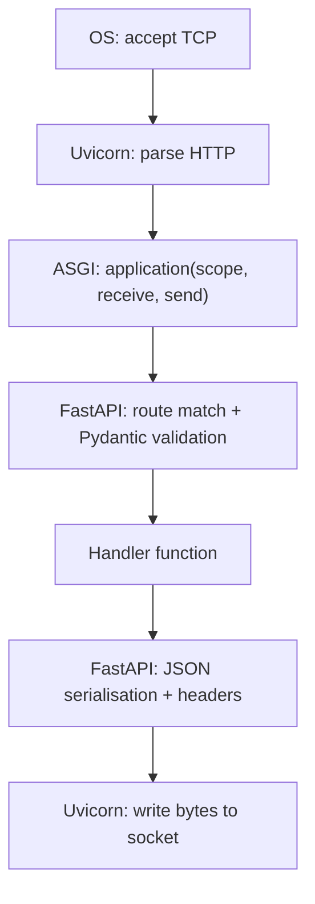

# Request Lifecycle — wire to handler

Recall card. Established in Lesson 3 (FastAPI).

**Q: Describe the full journey of a request from the wire to your handler
function, naming each layer.**

1. **OS / kernel** — accepts the TCP connection.
2. **Uvicorn (ASGI server)** — reads bytes from the socket, parses the HTTP
   request.
3. **ASGI contract** — Uvicorn calls FastAPI via
   `async application(scope, receive, send)`.
4. **FastAPI (routing + validation)** — matches the path to a route, extracts
   and validates path/query parameters, parses and validates the request body
   with Pydantic.
5. **FastAPI → handler** — calls your handler function with the validated
   arguments.
6. **Your handler** — returns a value (or raises `HTTPException`).
7. **FastAPI (serialisation)** — serialises the return value to JSON, builds
   headers, sends the response back through ASGI.
8. **Uvicorn** — writes the response bytes to the socket.

Layer boundaries worth remembering:

- Everything above the socket is **your** code only at step 6. Steps 2–5 and 7
  are framework/server territory.
- The ASGI contract (step 3) is the seam: swap Uvicorn for Hypercorn or Daphne
  and steps 4–7 are unchanged.
- A `422` never reaches your handler — it is produced at step 4.
